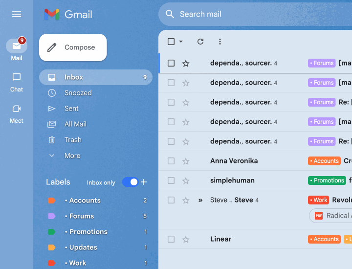

# Gmail Inbox Labels Chrome Extension

<!-- markdownlint-disable-next-line no-inline-html -->
<p align="center"></p>

**Bring Back Inbox's Best Feature to Gmail!**

This Chrome extension replicates a beloved feature from Google's now-deprecated Inbox app: when you click a label in Gmail's sidebar, you'll only see emails that are both in the inbox and have that label. This makes it easy to process your inbox by label, just like you could in Inbox.

The motivation behind this extension is to help users sort through emails more efficiently by allowing them to go through each bundle of inbox emails separately. With this extension, you can filter emails by label while ensuring that only inbox emails are displayed, helping you prioritize and organize more effectively.

## Installation

Since the extension is not yet verified on the Chrome Web Store, you can manually install it as a `.crx` file. Alternatively, you can download this repo and load the extension as an "unpacked extension" directly.

### 1. Download the `.crx` File

Download the extension's `.crx` file from [here](https://github.com/martimlobao/gmail-inbox-labels/releases).

### 2. Enable Developer Mode in Chrome

1. Open Google Chrome.
2. Go to `chrome://extensions/`.
3. Enable **Developer Mode** by toggling the switch in the top-right corner.

### 3. Install the Extension

1. Drag and drop the `.crx` file you downloaded into the `chrome://extensions/` page.
2. You may see a confirmation dialog. Click **Add Extension** to complete the installation.

The extension should now be installed and ready to use.

## Development

### Prerequisites

- Node.js (v18 or higher)
- A Chrome extension PEM key for signing

### Local Development

1. Clone the repository:

   ```bash
   git clone https://github.com/martimlobao/gmail-inbox-labels.git
   cd gmail-inbox-labels
   ```

2. Install dependencies

   ```bash
   npm install
   ```

3. Load the extension in Chrome
   - Open `chrome://extensions/`
   - Enable Developer Mode
   - Click "Load unpacked" and select the project directory

### Building the Extension

#### Local Build

To build the extension locally with your PEM key:

```bash
./scripts/build.sh /path/to/your/key.pem
```

This will create:

- `gmail-inbox-labels.crx` - Signed extension file
- `gmail-inbox-labels.zip` - ZIP file for Chrome Web Store

#### Automated Build with GitHub Actions

The extension can be automatically built and packaged using GitHub Actions:

1. **Set up the PEM key secret:**
   - Go to your repository settings
   - Navigate to Secrets and variables → Actions
   - Create a new secret named `EXTENSION_PEM_KEY`
   - Paste your PEM key content as the value

2. **Trigger the build:**
   - **Option A:** Push a tag starting with 'v' (e.g., `v1.2.1`)
   - **Option B:** Manually trigger the workflow from the Actions tab

3. **Download the artifacts:**
   - Go to the Actions tab in your repository
   - Click on the completed workflow run
   - Download the `extension-package` artifact

The workflow will:

- Package your extension into a `.crx` file (signed with your PEM key)
- Create a `.zip` file for Chrome Web Store submission
- Upload both files as artifacts
- Create a GitHub release (if triggered by a tag)

### File Structure

```text
gmail-inbox-labels/
├── .github/workflows/    # GitHub Actions workflows
├── scripts/              # Build scripts
├── images/               # Extension icons
├── content.js            # Main extension logic
├── styles.css            # Extension styles
├── manifest.json         # Extension manifest
└── package.json          # Project configuration
```
